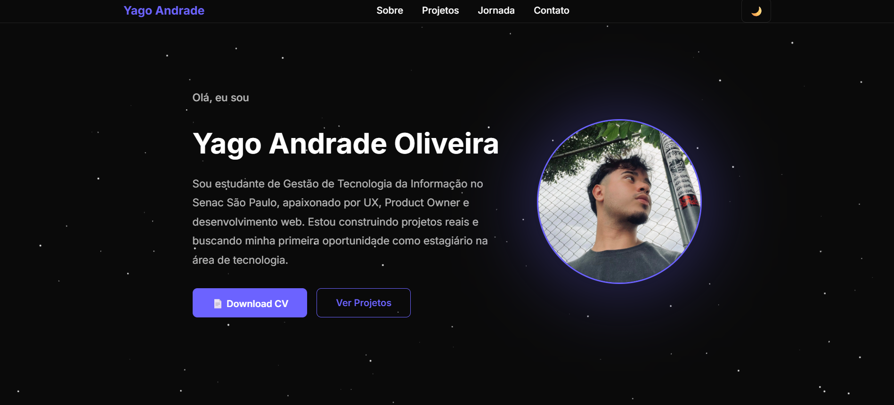

# 🌌 Portfólio Pessoal — Yago Andrade Oliveira

> Site pessoal para apresentar minha trajetória, projetos e habilidades em UX e desenvolvimento web — com tema dark, fundo animado e seções de Sobre, Projetos, Habilidades e Contato.

<br/>



<br/>

## ✨ Destaques

- 🌙 **Dark & Light Mode** — alternância suave entre temas
- 🌟 **Fundo animado** — estrelas em Canvas com movimento contínuo
- 📱 **Layout responsivo** — adaptado para diferentes telas
- ⚡ **Animações com GSAP** — entrada suave dos elementos e ScrollTrigger
- 🗂️ **Abas interativas** — Projetos, Certificados e Stack Tecnológica
- 📊 **Contadores animados** — estatísticas com scroll trigger
- 🗓️ **Timeline da jornada** — histórico com animação de entrada

<br/>

## 🛠️ Stack Tecnológica

| Tecnologia | Uso |
|---|---|
| HTML5 | Estrutura semântica |
| CSS3 | Estilização, variáveis e responsividade |
| JavaScript | Interatividade e lógica |
| GSAP 3 | Animações e ScrollTrigger |
| Canvas API | Fundo de estrelas animado |
| Devicons | Ícones das tecnologias |
| Google Fonts | Tipografia (Inter) |

<br/>

## 📁 Estrutura do Projeto

```
Portifolio/
├── index.html
├── style.css
├── script.js
└── assets/
    ├── avatar.png.webp
    ├── curriculo.pdf
    ├── cert1.png
    ├── preview-linkbio.jpg
    ├── preview-portfolio.png
    ├── preview-fintrack.jpg
    ├── preview-tripplanner.png
    ├── preview-lojatec.png
    ├── fintrack.pdf
    ├── HANDS_ON.pdf
    └── ADO2_21_05_2026.pdf
```

<br/>

## 🚀 Como rodar localmente

```bash
# Clone o repositório
git clone https://github.com/yagoAndrade9/Portifolio.git

# Acesse a pasta
cd Portifolio

# Abra o arquivo no navegador
# Basta abrir o index.html diretamente
# ou usar a extensão Live Server no VS Code
```

> Não requer instalação de dependências — é 100% HTML, CSS e JS puro.

<br/>

## 🗂️ Seções

| Seção | Descrição |
|---|---|
| **Sobre** | Apresentação pessoal com foto, descrição e botões de ação |
| **Projetos** | Cards com preview, descrição e links de cada projeto |
| **Certificados** | Galeria de certificações obtidas |
| **Stack** | Grade com as tecnologias que utilizo |
| **Jornada** | Timeline interativa da minha evolução |
| **Contato** | Links e formulário de contato |

<br/>

## 📌 Projetos em Destaque

- **Link Bio** — Página de links com tema claro/escuro em HTML e CSS puro
- **TripPlanner** — Sistema de planejamento de viagens com foco em UX
- **FinTrack** — Produto digital de finanças pessoais para jovens adultos
- **Loja Tech** — Sistema de gestão com 24 telas prototipadas no Figma (PO)
- **Portfólio** — Este projeto

<br/>

## 🔗 Links

- 🌐 **Deploy:** [yagoandrade9.github.io/Portifolio](https://yagoandrade9.github.io/Portifolio/)
- 💼 **LinkedIn:** [linkedin.com/in/yago-andrade-355473292](https://linkedin.com/in/yago-andrade-355473292/)
- 🐙 **GitHub:** [github.com/yagoAndrade9](https://github.com/yagoAndrade9)
- 📧 **E-mail:** ayago9482@gmail.com

<br/>

## 👨‍💻 Autor

Feito por **Yago Andrade Oliveira**  
Estudante de Gestão de Tecnologia da Informação — Senac São Paulo  
Focado em UX, Product Owner e desenvolvimento web.

<br/>

---

<p align="center">
  Feito com 💜 por Yago Andrade Oliveira · 2026
</p>
